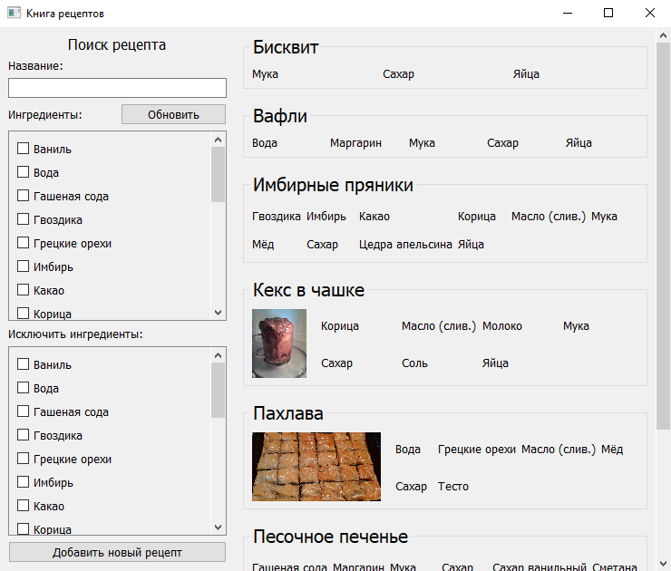
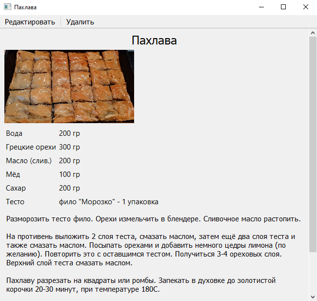
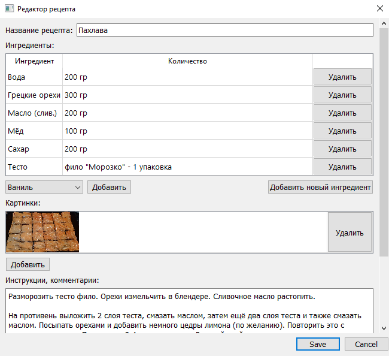

# Книга рецептов
## Идея
Программа позволяющая хранить, просматривать и искать рецепты с помощью фильтров.

## Реализация
Программы состоит из нескольких окон:

* Главное - в нём производиться поиск и выбор рецепта
* Просмотр рецепта - название, картинки, описание выбранного рецепта
* Редактор рецепта - позволяет редактировать или добавить новый рецепт
* Редактор ингредиентов - добавление и удаление ингредиентов

Данные хранятся в трёх таблицах:

* Recipes - название и описание рецептов
* Ingredients - все возможные ингредиенты
* RecipesIngredients - какой ингредиент, и в каком количестве используется в каждом рецепте

Для отображения окон используется библиотека PyQt5

## Скриншоты
Главное окно:

Окно рецепта:

Редактор рецептов:

Редактор ингредиентов:

